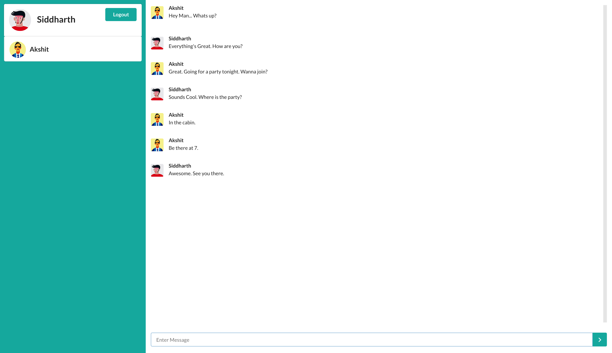

# Many-to-Many Chat App

A broadcast chat app build using [Pusher API](https://pusher.com/)

This project was bootstrapped with [create-react-app](https://github.com/facebook/create-react-app).
Client side is build with [React](https://reactjs.org/), [Redux](https://redux.js.org) and [Semantic UI React](http://react.semantic-ui.com/).
Server side is built with Express

## Getting Started

1. Clone this repo.
2. `yarn install`
3. Rename `src/config.sample.js` to `src/config.js` and fill credentials.
4. `yarn start`

## Walkthrough

1. Enter the username - Any username will do.
2. You will see 2 columns - Users Column, Messages Column.
    1. Users Column
        1. At the top - Your Username and Avatar (assigned randomly by server)
        2. Below - `react-virtualized` list of other users from authenticated Pusher API presence channel.
    2. Messages Column
        1. At the bottom - Message Input and Send. Submission sends a post request to server and the server broadcasts the message suing Pusher API.
        2. Above - `react-virtualized` list of messages.

## Screenshot

